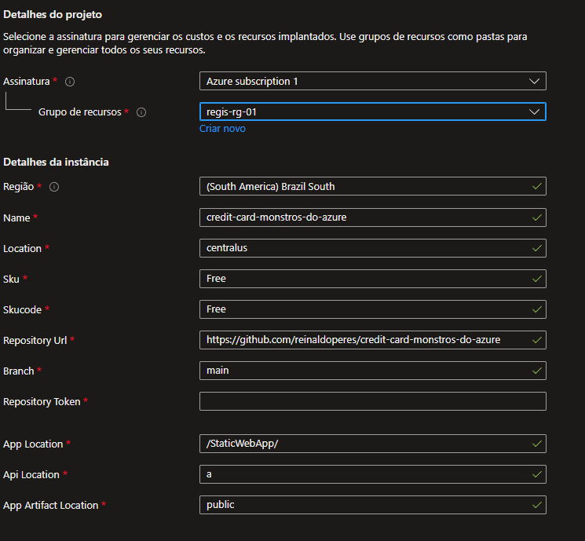

# credit-card-monstros-do-azure

A project of a simple credit card payment interface in a Azure Static Web App posting a transaction in a Azure Queue. To consume the queue was used Azure Function App with queue trigger.

- Using Gatsby to generate a Static Web Site. View documentation in [Gatsby](https://www.gatsbyjs.com)

## Static Web App
Just a simple credit card interface from CodePen, credits to [Adam Quinlan](https://codepen.io/quinlo/).

## Azure Function
C# project with a simple Azure Function App queue trigger.

## Azure Queue
An example for how to configure your static Web App with your repository

